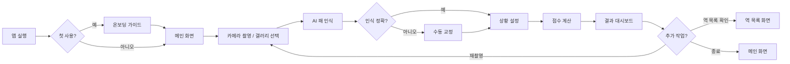

# 02. 핵심 워크플로우

## 0. 사용자 여정 맵 (User Journey)

## 1. 패 인식 (Tile Recognition)
카메라 인터페이스를 통해 14개의 패(울음 패 포함)를 **실시간 오프라인**으로 인식합니다.
- **오프라인 우선 전략 (Offline-First)**: 서버 통신 없이 디바이스 내에서 모든 인식을 처리하여 보안성과 속도를 확보합니다.
- **객체 탐지 (YOLO)**: 단순 분류(Classification)가 아닌 YOLOv8/v11 Nano 모델을 활용한 객체 탐지 방식을 사용합니다. 한 화면에 있는 13~14개의 패를 동시에 탐지하고 위치를 파악합니다.
- **인식 대상**: 만수, 통수, 삭수, 자패(풍패/삼원패) 등 총 34종의 타일 클래스. 적오(Red Five: 적색 5만, 5통, 5삭)는 별도 클래스로 분류하지 않고, 후처리 단계에서 색상 분석으로 구분합니다.
- **상태 구분**: 안깡, 민깡, 치, 퐁 등 울음 상태와 일반적인 대기 패를 공간적 배치를 통해 구분합니다.

> [!NOTE]
> **공간적 배치 기반 구분의 한계**: 촬영 각도 및 패 배치 불규칙성에 따라 오인식 가능성이 존재합니다. 폴백 전략으로 (1) 수동 교정 UI를 항상 제공하고, (2) 인식 신뢰도(Confidence)가 임계치(0.7) 미만인 경우 자동으로 교정 패널을 표시합니다.

## 2. 수동 교정 (Manual Correction)
AI 인식 오류 발생 시 사용자가 직접 패를 수정할 수 있는 인터페이스를 제공합니다.
- **패 교정 패널 (TileCorrectionPanel)**: 인식된 패를 탭하여 다른 패로 교체하거나 순서를 변경합니다.
- **탭 분리 선택기**: 34종 패를 만수/통수/삭수/자패 4개 탭으로 분리하여 정보 과부하를 방지합니다.
- **드래그 앤 드롭 (Drag & Drop)**: 패의 위치를 직관적으로 변경하여 역 판정에 영향을 주는 순서 조정을 가능하게 합니다.

## 3. 상황 설정 (Context Setup)
정확한 점수 계산을 위해 필요한 외부 변수들을 설정합니다.
- **도라 (Dora)**: 표지패 또는 직접적인 도라 패를 지정합니다.
- **자풍 (Seat Wind)**: 동, 남, 서, 북 중 본인의 자리를 설정합니다.
- **장풍 (Prevalent Wind)**: 동장, 남장 등 현재 국의 상태를 설정합니다.
- **화료 방식 (Winning Method)**: 쯔모(Tsumo) 또는 론(Ron)을 선택합니다.
- **특수 상황 (Special Conditions)**: 리치, 더블 리치, 일발, 하이테이, 린샹카이호우 등 부가적인 상황을 체크합니다.
