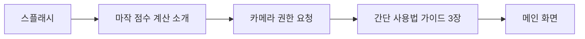

# 05. UI/UX 디자인

## 0. 디자인 원칙

| 원칙 | 설명 |
| :--- | :--- |
| **다크 모드 우선** | 기본 테마는 다크 모드. 라이트 모드도 완전 지원. |
| **모바일 우선** | 폰 화면 최적화 우선, 태블릿은 적응형 레이아웃으로 대응. |
| **접근성** | 색각이상자를 위해 패 구분은 색상+형태(숫자/문양) 병행. 최소 터치 영역 48dp. |
| **정보 계층화** | 핵심 정보(점수)를 최상위에, 상세 정보(역/부수)는 펼침 구조로 제공. |

## 1. 온보딩 플로우 (첫 실행 시)

- 3장의 캐러셀 형태 튜토리얼 (촬영→교정→결과)
- "건너뛰기" 옵션 항상 제공
- 온보딩 완료 후 재표시하지 않음

## 2. 주요 화면 (Primary Screens)

### 메인 화면 (MahjongScreen)
- **기능 카드 그리드**: 카메라 인식, 수동 입력, 역 목록 3개 진입점 제공
- **최근 계산 이력**: 하단에 간략한 최근 기록 표시 (v2.0)

### 패 인식 화면 (TileRecognitionScreen)
- **카메라 뷰포트**: 중앙에 패를 정렬할 수 있는 14칸 그리드 가이드라인 제공.
- **스캔 버튼**: 현재 화면의 패를 캡처하여 인식 프로세스 시작.
- **갤러리 버튼**: 기존 촬영 이미지에서 인식 가능.
- **플래시 토글**: 어두운 곳에서도 인식이 가능하도록 플래시 제어.

### 패 교정 패널 (TileCorrectionPanel - Overlay)
- **그리드 뷰**: 인식된 14개의 패를 그리드 형태로 표시.
- **탭 분리 선택기**: 만수/통수/삭수/자패 4개 탭으로 분리하여 교체 가능한 패 목록 표시.
- **드래그 앤 드롭**: 패 순서 조정 가능.

### 수동 입력 화면 (YakuCalculationScreen)
- **34종 패 그리드**: 만수/통수/삭수/자패 탭으로 분리된 선택 인터페이스.
- **선택된 패 미리보기**: 상단에 현재 선택된 패 14개를 실시간 표시.
- **울음(Meld) 설정**: 치/퐁/깡 입력을 위한 별도 섹션.

### 상황 설정 패널 (GameStatePanel)
- **퀵 셀렉터**: 동/남/서/북, 리이치 여부, 도라 수 등을 탭하여 빠르게 설정.
- **토글 스위치**: 쯔모/론, 일발 등 상태 설정.

### 점수 결과 화면 (ScoreResultScreen)
> ResultListScreen과 ScoreResultDashboard를 통합한 단일 결과 화면

- **대형 타이포그래피**: 최종 점수를 가장 크게 표시.
- **분배 표 (Distribution Table)**: 정산 금액(예: 오야 12000, 자 4000/4000)을 명확히 시각화.
- **역 목록 섹션**: 적용된 각 역의 이름(한국어)과 판수를 리스트업. 아코디언 형태로 상세 설명 펼침 가능.
- **부수 내역 섹션**: 부수 계산 근거를 접이식으로 표시.

### 역 목록 화면 (YakuListScreen)
- **카테고리별 정리**: 1판~역만까지 카테고리 분류.
- **검색 기능**: 역 이름(한국어/일본어)으로 검색.

## 3. 인터랙션 디자인 (Interaction Design)
- **햅틱 피드백**: 인식 성공, 버튼 클릭, 계산 완료 시 적절한 진동 피드백 제공. (iOS 우선 구현, Android는 디바이스별 편차 고려)
- **부드러운 전환 (Smooth Transitions)**: 화면 전환 시 Voyager의 네이티브 애니메이션을 활용하여 부드러운 사용자 경험 제공.
- **마이크로 애니메이션**: 계산 프로세스 진행 중임을 알리는 인디케이터나 점수 카운팅 효과 적용.

## 4. 반응형 레이아웃 정책
- **폰(< 600dp)**: 단일 컬럼 레이아웃, 하단 시트 활용.
- **태블릿(≥ 600dp)**: 2컬럼 레이아웃 (좌: 패 입력/인식, 우: 결과/설정).
- **가로 모드**: 카메라 화면만 가로 모드 지원, 나머지 화면은 세로 고정.
