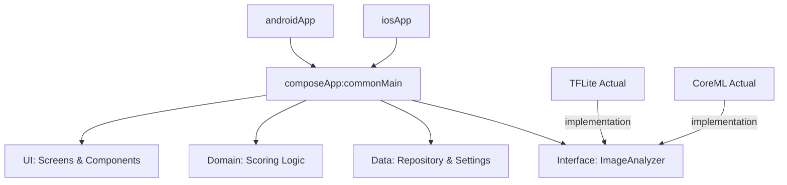

# 06. Technical Architecture

## 1. Zero-Fragmentation Policy (AGENTS.md)
본 프로젝트는 `AGENTS.md`의 지침을 엄격히 준수하여 플랫폼 간 파편화를 최소화합니다.
- **commonMain**: 비즈니스 로직, 데이터 모델, UI 컴포넌트, 네비게이션을 99.9% 포함.
- **Platform Abstraction**: 카메라 API 및 ML 추론(Inference) 엔진과 같이 플랫폼 의존적인 기능은 Interface를 통해 추상화하고 DI로 주입.

## 2. Tech Stack
- **UI Framework**: Compose Multiplatform
- **Navigation**: Voyager
- **Dependency Injection**: Kotlin-Inject
- **Asynchronous**: Coroutines & Flow
- **ML Inference**: 
    - **Android**: TensorFlow Lite (ML Kit)
    - **iOS**: CoreML (Vision Framework)
- **Model Architecture**: YOLOv8/v11 Nano
- **Local Storage**: Multiplatform Settings

## 3. Modular Structure

## 4. Coding Standards
- **Brace Style**: K&R style (opening brace on the same line).
- **Newline**: 모든 파일의 끝에는 하나의 빈 줄(Empty newline)을 유지.
- **Naming**: Kotlin 표준 코딩 컨벤션 및 Voyager Screen 네이밍 규칙 준수.
