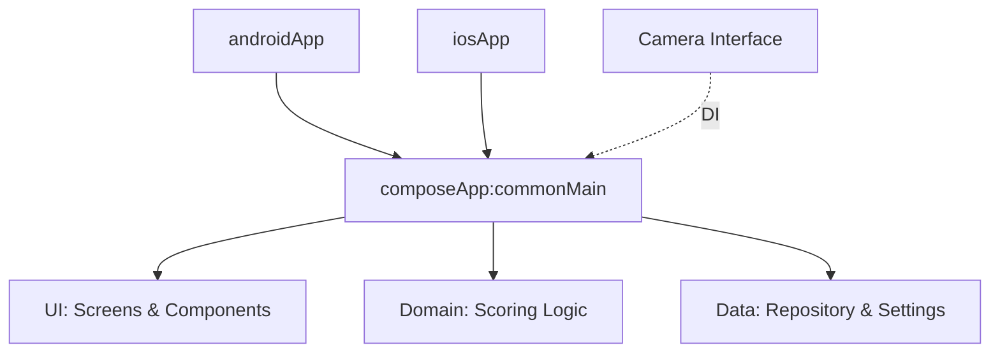

# 06. Technical Architecture

## 1. Zero-Fragmentation Policy (AGENTS.md)
본 프로젝트는 `AGENTS.md`의 지침을 엄격히 준수하여 플랫폼 간 파편화를 최소화합니다.
- **commonMain**: 비즈니스 로직, 데이터 모델, UI 컴포넌트, 네비게이션을 99.9% 포함.
- **No Native UI**: `androidApp` 및 `iosApp` 모듈에는 UI 코드를 작성하지 않으며, 공통 UI인 Compose Multiplatform만 사용.
- **Dependency Injection**: 플랫폼별 API가 필요한 경우(카메라 접근 등) Interface를 정의하고 `kotlin-inject`를 통해 주입.

## 2. Tech Stack
- **UI Framework**: Compose Multiplatform
- **Navigation**: Voyager
- **Dependency Injection**: Kotlin-Inject
- **Asynchronous**: Coroutines & Flow
- **Local Storage**: Multiplatform Settings
- **Serialization**: kotlinx.serialization

## 3. Modular Structure

## 4. Coding Standards
- **Brace Style**: K&R style (opening brace on the same line).
- **Newline**: 모든 파일의 끝에는 하나의 빈 줄(Empty newline)을 유지.
- **Naming**: Kotlin 표준 코딩 컨벤션 및 Voyager Screen 네이밍 규칙 준수.
