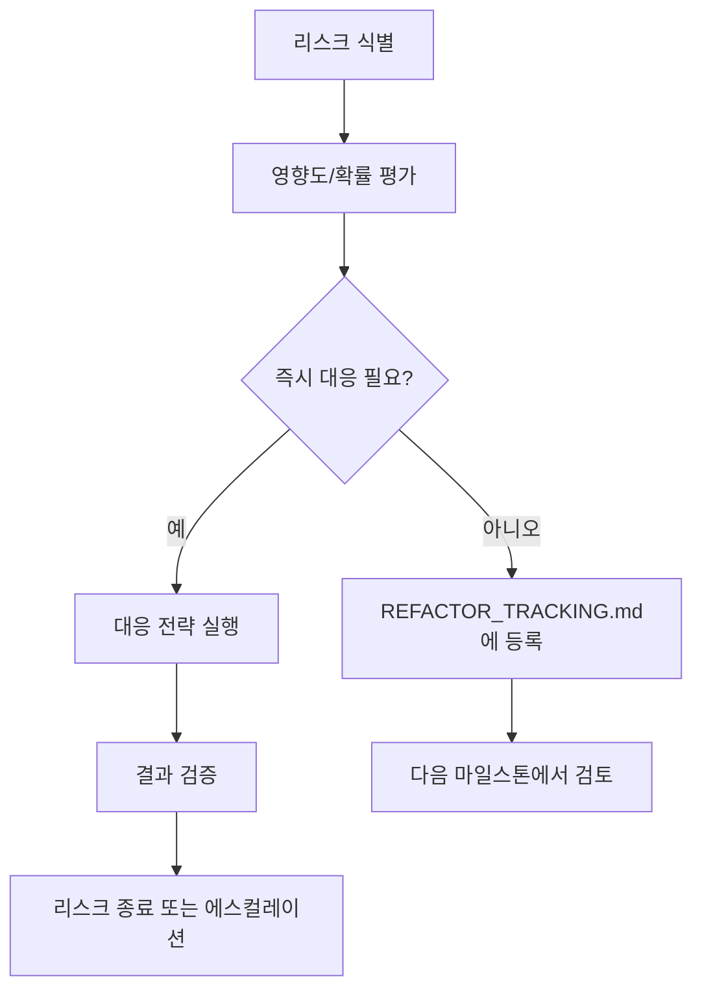

# 09. 리스크 관리 (Risk Management)

## 1. 리스크 매트릭스

| ID | 분류 | 리스크 | 영향도 | 발생 확률 | 대응 전략 |
|:---|:---|:---|:---:|:---:|:---|
| R01 | 기술 | ML 모델 정확도 미달 (mAP < 95%) | 🔴 높음 | 🟡 중간 | 합성 데이터 품질 강화, 실제 사진 데이터 보충, 하이퍼파라미터 그리드 서치 |
| R02 | 기술 | TFLite ↔ CoreML 변환 시 정확도 편차 | 🟡 중간 | 🟡 중간 | 동일 테스트셋 기준 벤치마크, 플랫폼별 개별 파인튜닝 검토 |
| R03 | 기술 | 디바이스별 카메라 API 호환성 이슈 | 🟡 중간 | 🔴 높음 | CameraX(Android) / AVFoundation(iOS) 사용으로 표준화, 폴백으로 갤러리 입력 제공 |
| R04 | 기술 | 모델 크기 10MB 초과로 앱 사이즈 증가 | 🟢 낮음 | 🟡 중간 | FP16 양자화, INT8 양자화 적용, 프루닝 검토 |
| R05 | 운영 | 앱스토어 심사 리젝 (카메라 권한) | 🟡 중간 | 🟡 중간 | 권한 사용 사유 명확 기술, 대체 플로우(갤러리) 제공 |
| R06 | 운영 | 개인정보 이슈 (촬영 이미지 처리) | 🔴 높음 | 🟢 낮음 | 촬영 데이터는 디바이스 내에서만 처리, 서버 전송 없음 명시, 개인정보 처리방침 작성 |
| R07 | 시장 | 경쟁 앱의 선제적 시장 진입 | 🟡 중간 | 🟢 낮음 | 한국어 특화, UX 차별화, 빠른 MVP 론칭으로 선점 |
| R08 | 기술 | 공간적 배치 기반 울음 패 구분 실패 | 🟡 중간 | 🔴 높음 | 수동 교정 UI를 필수 폴백으로 제공, 신뢰도 기반 자동 교정 패널 표시 |
| R09 | 일정 | Phase 2 ML 학습이 Phase 1 데이터에 직렬 의존 | 🔴 높음 | 🟡 중간 | Phase 1 데이터 품질 게이트(무결성 검사) 통과 후에만 Phase 2 진행 |

## 2. 리스크 대응 프로세스

