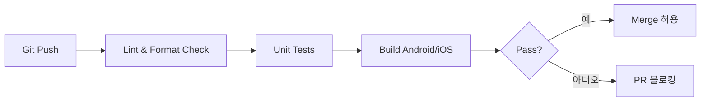

# 11. 테스트 전략 (Test Strategy)

## 1. 테스트 유형 및 커버리지

| 유형 | 대상 | 도구 | 목표 커버리지 |
| :--- | :--- | :--- | :--- |
| **단위 테스트** | 계산 엔진 (Yaku, Fu, Score) | kotlin.test, JUnit | 100% (42종 역 + 부수 조합) |
| **단위 테스트** | Agari 판정 | kotlin.test | 100% (유효/무효 핸드 경계 케이스) |
| **단위 테스트** | 적오(Red Five) 처리 | kotlin.test | 100% |
| **통합 테스트** | ML 인퍼런스 파이프라인 | 샘플 이미지 → 결과 비교 | 주요 패턴 20개 이상 |
| **UI 테스트** | 화면 전환, 입력 플로우 | Compose UI Test | 핵심 플로우 5개 |
| **성능 테스트** | 인퍼런스 속도, UI 프레임 | 벤치마크 스크립트 | SLA 기준 충족 |
| **회귀 테스트** | ML 모델 업데이트 시 | 고정 테스트셋 | 정확도 드롭 없음 |

## 2. 마작 룰 검증 매트릭스 (주요 역)

| 카테고리 | 역 | 테스트 상태 |
| :--- | :--- | :--- |
| **1판** | 리이치, 멘젠쯔모, 핑후, 탕야오, 이페코, 역패(풍/삼원) | 필수 |
| **2판** | 더블리치, 찬타, 산안커, 산색동순, 이쯔, 토이토이, 산색동각, 삼깡쯔, 쇼산겐, 혼로토 | 필수 |
| **3판** | 혼일색, 준찬타 | 필수 |
| **6판** | 청일색 | 필수 |
| **역만** | 국사무쌍, 사안커, 대삼원, 자일색, 녹일색, 구련보등, 청노두, 소사희, 대사희, 천화, 지화 | 필수 |
| **특수** | 일발, 하이테이, 호테이, 린샹카이호우, 창깡 | 필수 |

## 3. 엣지 케이스 테스트

| 시나리오 | 예상 동작 |
| :--- | :--- |
| 후리텐(Furiten) 상태에서 론 시도 | 론 불가, 에러 메시지 표시 |
| 핑후 + 쯔모 시 부수 계산 | 기본 부수 20 적용 |
| 복합 역 (핑후 + 이페코 + 탕야오) | 모든 역 동시 인정, 번수 합산 |
| 13장 입력 (미완성 핸드) | 아가리 판정 실패, 가이드 메시지 |
| 동일 패 5장 입력 시도 | 입력 거부, 제한 안내 |
| 적오 5만 + 일반 5만 혼합 | 각각 정확히 구분, 도라 계산 정확 |

## 4. 디바이스 호환성 매트릭스

| 플랫폼 | 최소 사양 | 권장 테스트 기기 |
| :--- | :--- | :--- |
| **Android** | API 26 (8.0), RAM 3GB | Pixel 6a, Galaxy S21, Galaxy A32 |
| **iOS** | iOS 16.0, iPhone 8 이상 | iPhone 13, iPhone SE 3세대, iPad Air 5세대 |

## 5. CI/CD 파이프라인 (계획)

