# 12. WBS (Work Breakdown Structure)

> **버전**: v3.0 (3회 반복 검토 완료)  
> **총 예상 기간**: 18~20주 (리스크 버퍼 포함)  
> **기준**: 1인 AI 에이전트 기반 개발, 3개 에이전트 분업 (Jules/Antigravity/Gemini CLI)

---

## 크리티컬 패스 (Critical Path)

```mermaid
flowchart LR
    M01002[01002 합성+계산] --> M01003[01003 대규모 데이터]
    M01003 --> M02001[02001 YOLO 학습]
    M02001 --> M02002[02002 모델 Export]
    M02002 --> M02003[02003 추론 인터페이스]
    M02003 --> M02004[02004 카메라 파이프라인]
    M02004 --> M03002[03002 카메라 오버레이]
    M03002 --> M03003[03003 점수 결과 화면]
    M03003 --> M03005[03005 UI 검증]
    M03005 --> LAUNCH[v1.0-beta 론칭]
    
    style M01003 fill:#ff6b6b,color:#fff
    style M02001 fill:#ff6b6b,color:#fff
    style M02002 fill:#ff6b6b,color:#fff
```

---

## Phase 1: 기반 구축 및 데이터 합성 (주차 1~5)

| WBS ID | 마일스톤 | 담당 | 선행 작업 | 소요 기간 | 산출물 | 비고 |
|:---|:---|:---|:---|:---|:---|:---|
| 1.1 | **01001** KMP 인프라 감사 및 통합 | Antigravity | — | 1주 | 모노레포 구조, SUMMARY.xml, AGENTS.md | ✅ 완료 |
| 1.2 | **01002** 합성 파이프라인 및 계산 엔진 | Jules (병렬) | 01001 | 2주 | 합성 스크립트, MahjongCalculator 프로토타입 | ✅ 완료 |
| 1.3 | **01003** 대규모 학습 데이터 생성 | Jules | 01002 | 1~2주 | 100k+ YOLO 이미지+라벨 | 🔴 크리티컬 패스 |
| 1.4 | **01004** 로직 검증 | Antigravity | 01002 | 1주 | 42종 역 테스트, 적오 검증 | ⚡ 01003과 병렬 가능 |
| 1.5 | **01005** 환경 검증 | Gemini CLI | 01003, 01004 | 0.5주 | 빌드 무결성 리포트 | 🚦 **품질 게이트 #1** |

### Phase 1 품질 게이트 기준
- [ ] 100k+ 이미지 생성 완료 및 무결성 검사 통과
- [ ] `./gradlew build` 성공
- [ ] 42종 역 단위 테스트 100% 통과

---

## Phase 1.5: 품질 보증 및 도메인 갭 해소 (주차 5~6)

| WBS ID | 마일스톤 | 담당 | 선행 작업 | 소요 기간 | 산출물 | 비고 |
|:---|:---|:---|:---|:---|:---|:---|
| 1.5.1 | **01501** 계산 엔진 엣지 케이스 | Jules | 01004 | 1주 | 단위 테스트, 엣지 케이스 통과 | 🔴 크리티컬 패스 |
| 1.5.2 | **01502** 합성 데이터 도메인 적응 | Antigravity | 01003 | 1주 | 증강 데이터셋, 품질 매트릭스 | 🔴 크리티컬 패스 |
| 1.5.3 | **01503** 자동화 검증 파이프라인 | Gemini CLI | 01501, 01502 | 0.5주 | CI 스크립트 | 🚦 **품질 게이트 #1.5** |

---

## Phase 2: AI 모델 학습 및 최적화 (주차 6~11)

| WBS ID | 마일스톤 | 담당 | 선행 작업 | 소요 기간 | 산출물 | 비고 |
|:---|:---|:---|:---|:---|:---|:---|
| 2.1 | **02001** YOLO 학습 | Antigravity | 01005(Gate) | 2주 | 학습된 YOLO 모델 (mAP ≥ 95%) | 🔴 크리티컬 패스 |
| 2.2 | **02002** 모델 내보내기 | Antigravity | 02001 | 1주 | .tflite, .mlmodel (≤ 10MB 각) | 🔴 크리티컬 패스 |
| 2.3 | **02003** 추론 인터페이스 | Antigravity | 02002 | 1주 | MahjongDetector 인터페이스, NMS 후처리 | 🔴 크리티컬 패스 |
| 2.4 | **02004** 카메라 파이프라인 | Antigravity | 02003 | 1.5주 | CameraPreview, 프레임 처리 파이프라인 | 🔴 크리티컬 패스 |
| 2.5 | **02005** DI 연결 | Antigravity | 02002 | 1주 | AppModule, 의존성 그래프 | ⚡ 02003~02004와 병렬 가능 |
| 2.6 | **02006** ML 통합 검증 | Gemini CLI | 02004, 02005 | 1주 | 통합 벤치마크 리포트 | 🚦 **품질 게이트 #2** |

### Phase 2 품질 게이트 기준
- [ ] mAP ≥ 95% 달성
- [ ] 모델 크기 ≤ 10MB
- [ ] TFLite ↔ CoreML 정확도 편차 ≤ 1%
- [ ] 인퍼런스 < 200ms/프레임

---

## v1.0-alpha 론칭 포인트 (주차 8~9)

> **린 론칭 전략**: Phase 2의 ML 학습과 병렬로, 수동 입력 기반 계산기(v1.0-alpha)를 먼저 스토어에 출시하여 시장 반응 검증

| WBS ID | 작업 | 담당 | 선행 작업 | 소요 기간 | 산출물 |
|:---|:---|:---|:---|:---|:---|
| α.1 | v1.0-alpha 디자인 시스템 | Antigravity | 01004 | 1주 | MahjongTheme, 핵심 컴포넌트 |
| α.2 | v1.0-alpha 수동 입력 + 결과 UI | Antigravity | α.1 | 1주 | YakuCalculationScreen 고도화, ScoreResultScreen |
| α.3 | v1.0-alpha QA 및 스토어 제출 | Gemini CLI | α.2 | 0.5주 | 릴리즈 빌드, 스토어 메타데이터 |

---

## Phase 3: UI 통합 및 UX 다듬기 (주차 12~16)

| WBS ID | 마일스톤 | 담당 | 선행 작업 | 소요 기간 | 산출물 | 비고 |
|:---|:---|:---|:---|:---|:---|:---|
| 3.1 | **03001** 디자인 시스템 | Antigravity | 02006(Gate) | 1주 | MahjongTheme, TileCard, YakuBadge 등 | α에서 일부 선행 가능 |
| 3.2 | **03002** 카메라 오버레이 | Antigravity | 03001, 02004 | 1.5주 | BoundingBoxOverlay, 신뢰도 표시 | 🔴 크리티컬 패스 |
| 3.3 | **03003** 점수 결과 화면 | Antigravity | 03001 | 1주 | ScoreResultScreen (통합) | 🔴 크리티컬 패스 |
| 3.4 | **03004** 피드백 루프 | Jules | 03002 | 1주 | 오인식 수집 로직, 자동 교정 알고리즘 | ⚡ 03003과 병렬 가능 |
| 3.5 | **03005** UI 검증 | Gemini CLI | 03001~03004 | 1주 | UI 벤치마크, A11y 리포트, 온보딩 검증 | 🚦 **품질 게이트 #3** |

### v1.0-beta 론칭 (주차 16~17)
| WBS ID | 작업 | 담당 | 선행 작업 | 소요 기간 | 산출물 |
|:---|:---|:---|:---|:---|:---|
| β.1 | RC 테스트 | Gemini CLI | 03005(Gate) | 0.5주 | RC 테스트 리포트 |
| β.2 | 스토어 업데이트 (카메라 인식 추가) | Antigravity | β.1 | 0.5주 | v1.0-beta 릴리즈 |

### Phase 3 품질 게이트 기준
- [ ] 60fps 유지
- [ ] Safe Area 이슈 0건
- [ ] 접근성(A11y) 기본 검증 통과
- [ ] 온보딩 플로우 정상 동작

---

## Phase 4: 확장 및 v2.0 준비 (주차 18+)

> [!NOTE]
> Phase 4는 v1.0 론칭 후 사용자 피드백을 반영하여 일정이 조정될 수 있습니다.

| WBS ID | 마일스톤 | 담당 | 선행 작업 | 소요 기간 | 산출물 |
|:---|:---|:---|:---|:---|:---|
| 4.1 | **04001** 히스토리 추적 | Jules | v1.0-beta | 1.5주 | SQLDelight 스키마, Repository |
| 4.2 | **04002** 통계 UI | Antigravity | 04001 | 1주 | StatisticsScreen |
| 4.3 | **04003** 내보내기 및 동기화 | Jules | 04001 | 1.5주 | Export 로직, 동기화 프로토타입 |
| 4.4 | **04004** 최종 준비 | Gemini CLI | 04002, 04003 | 1주 | 최종 감사, ASO, 다국어 준비 |

---

## 리소스 할당 요약

| 에이전트 | Phase 1 | Phase 1.5 | Phase 2 | Phase 3 | Phase 4 | 총 작업 수 |
|:---|:---:|:---:|:---:|:---:|:---:|:---:|
| **Jules** | 3 | 1 | 0 | 1 | 2 | **7** |
| **Antigravity** | 1 | 1 | 5 (+α) | 3 (+β) | 1 | **11+** |
| **Gemini CLI** | 1 | 1 | 1 | 1 (+β) | 1 | **5+** |

---

## 병렬화 가능 작업 식별

| 병렬 그룹 | 작업 A | 작업 B | 조건 |
|:---|:---|:---|:---|
| PG-1 | 01003 (데이터 생성, ml-pipeline/) | 01004 (로직 검증, app/) | 모듈 분리, 파일 충돌 없음 |
| PG-2 | 02003 (추론 인터페이스) | 02005 (DI Wiring) | 독립적 모듈 |
| PG-3 | 03003 (결과 화면) | 03004 (피드백 루프) | 화면 vs 로직 |
| PG-α | v1.0-alpha UI 작업 | Phase 2 ML 학습 | 완전 독립 트랙 |
